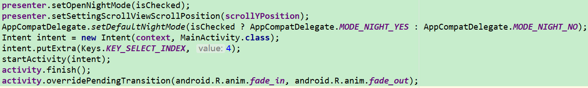

# v9porn

9*Porn Android 客户端，突破游客每天观看10次视频的限制，还可以下载视频。

源代码： [https://github.com/techGay/v9porn](https://github.com/techGay/v9porn)

##技术概览

rxjava + retrofit + rxcache + mvp + jsoup + dagger2

mosby Mvp框架

QMUI Android 腾讯开源的Android UI框架

BaseRecyclerViewAdapterHelper RecyclerViewAdapter类库

jsoup 一款Java的HTML解析器，主要用来对HTML解析

de.greenrobot:java-common Java常用/实用方法库（copyFile）

### 笔记
> jsoup 
> 	
> 要被解析的HTML可以是一个HTML的字符串，可以是一个URL，可以是一个文件
> 
> [https://www.jianshu.com/p/610c99da01e7](https://www.jianshu.com/p/610c99da01e7)

> Android矢量图开发
> 
> 5.0才开始支持VectorDrawable
> 	
> 属性:vector-根标签，表示一个矢量动画;group-定义一组路径和子group，另外还定义了转换信息(transformation information);path-定义一个路径，一个路径即可以表示一块填充区域也可以表示一根线条
> 
> [https://www.cnblogs.com/guanxinjing/category/1475688.html](https://www.cnblogs.com/guanxinjing/category/1475688.html)
> 
> 夜间模式
> 
> 采用投机取巧的方式，保存当前页面的状态，重启页面（关闭页面后再打开,淡入淡出动画使得更加自然）

> ItemTouchHelper：官方support-v7包下，处理RecyclerView的item位置拖动逻辑。